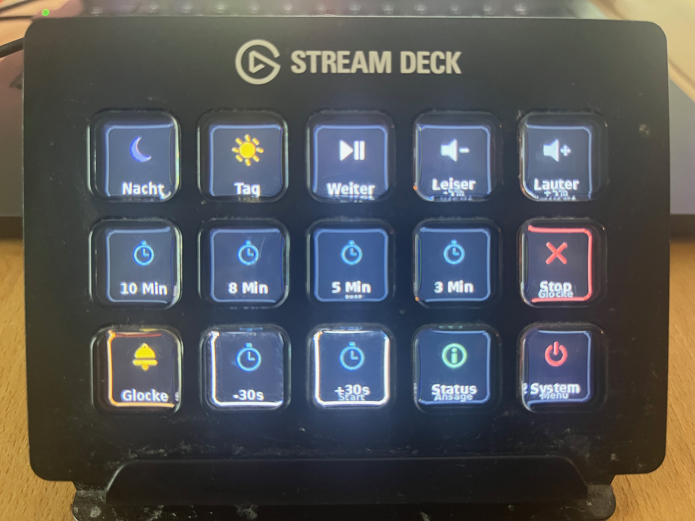
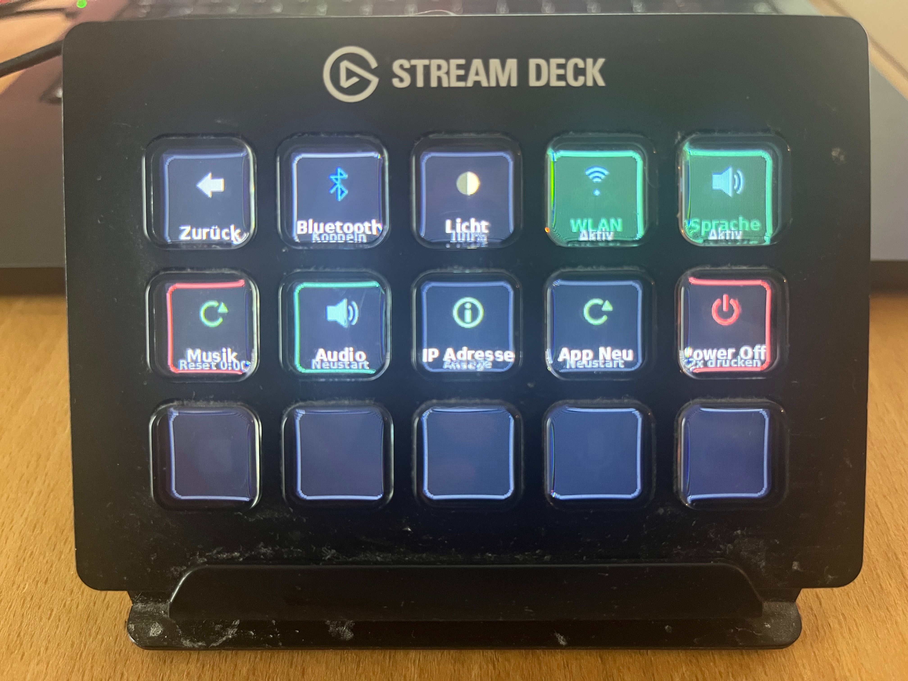
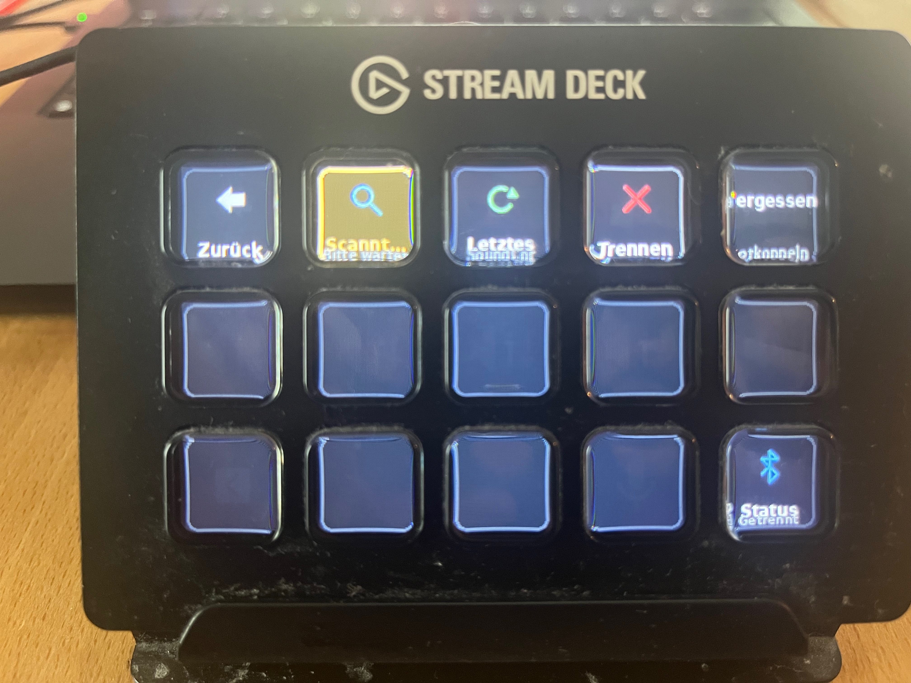
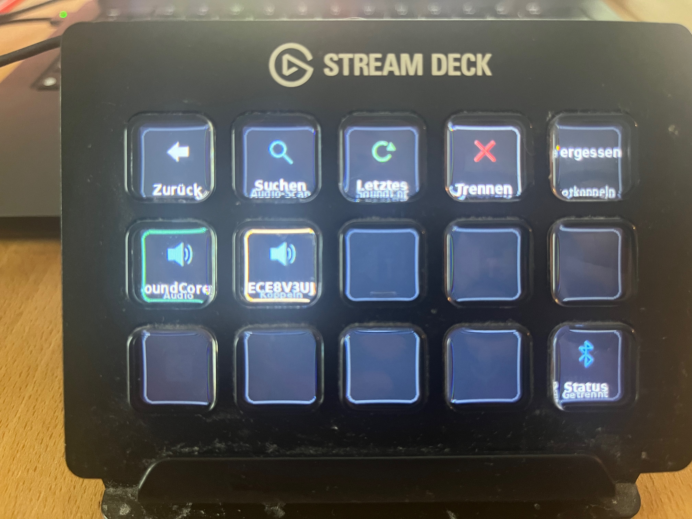

# Blood on the Clocktower – Stream Deck Controller 🕰️

<p align="center">
  <b>English</b> &bull; 
  <a href="README.de.md">🇩🇪 Deutsche Version</a> &bull; 
  <a href="INSTALL.md">📖 Installation Guide (EN)</a> &bull; 
  <a href="INSTALL.de.md">Installationsanleitung (DE)</a>
</p>

<p align="center">
  
  
  
  
</p>

An autonomous standalone hardware control console for the Storyteller of **Blood on the Clocktower**, powered by a **Raspberry Pi** and an **Elgato Stream Deck** (15 keys).

Designed for screenless, distraction-free tabletop operation—featuring wireless Bluetooth audio streaming, live countdowns directly on the key displays, smooth crossfading with exact position memory, and intelligent voice feedback.

---

## Hardware in Action

<p align="center">
  
  
</p>
<p align="center">
  <em>Left: Main gameplay screen &bull; Right: Protected system & utilities menu</em>
</p>

<p align="center">
  
  
</p>
<p align="center">
  <em>Headless Bluetooth management: Scan for nearby speakers (left) and pair with a single tap (right).</em>
</p>

---

## Features & Highlights

* 🎵 **Day & Night Atmosphere**: Seamless crossfading between day and night phases. Remembers playback position to the second and resumes precisely where you left off when returning to the phase.
* 🩸 **Atmospheric Night Theme (Grimoire Red)**: When entering the Night phase, all button labels and borders automatically shift to blood red / night-vision crimson with subtle dark wine outlines to preserve night vision and set a grim mood at the table, while reverting to crisp white during the Day.
* ⏱️ **Timers with Live Countdown**: Preset durations for 10, 8, 5, and 3 minutes. Displays dynamic countdowns (`MM:SS`) directly on the keys, turning orange when `<30s` remain and flashing red alarm when `<10s` remain.

* ⚡ **Quick Adjust (+30s / -30s)**: Need just a bit more town discussion before nominations? Tap `+30s` for an instant 30-second extension (or long-press for +1 minute).
* 🔔 **Town Bell & Silence**: When the timer expires or when canceled via Stop / Bell, music cuts immediately and `bell.mp3` tolls. Silence follows naturally until the next phase is started.
* 📶 **Headless Bluetooth (No Monitor Needed)**: Full device discovery and 1-tap pairing handled directly through the Stream Deck keys. Displays discovered speaker names (e.g. SoundCore, JBL) and automatically reconnects on startup.
* 🔄 **Music & Audio Reset**: Fast track reset to `0:00` via long-press on Day/Night or via the System menu.
* 🔊 **Voice Feedback (TTS)**: Clean voice prompts for speaker connection status, volume percentage, timer status, and IP address.
* 🌙 **Dimmable Backlight**: Switch key brightness (100% / 50% / 15%) in the protected menu for atmospheric dim-lit night rounds.
* 🛡️ **Protected System Menu & Safe Power Off**: Guarded against accidental clicks during gameplay, featuring a 2-tap confirmation shutdown to prevent SD card corruption.

---

## Key Layout

### 1. Main Page (During Gameplay)
```
┌──────────────┬──────────────┬──────────────┬──────────────┬──────────────┐
│  [0] Night   │   [1] Day    │  [2] Pause   │  [3] Vol -   │  [4] Vol +   │
│  (Moon Icon) │  (Sun Icon)  │   / Resume   │    (-5%)     │    (+5%)     │
├──────────────┼──────────────┼──────────────┼──────────────┼──────────────┤
│  [5] 10 Min  │  [6] 8 Min   │  [7] 5 Min   │  [8] 3 Min   │  [9] Stop    │
│  (Live MM:SS)│  (Live MM:SS)│  (Live MM:SS)│  (Live MM:SS)│  (Bell toll) │
├──────────────┼──────────────┼──────────────┼──────────────┼──────────────┤
│ [10] Bell    │ [11] -30s    │ [12] +30s    │ [13] Status  │ [14] System  │
│ (Manual toll)│ (Timer -30s) │ (+1m long)   │ (TTS Announce│   (Menu)     │
└──────────────┴──────────────┴──────────────┴──────────────┴──────────────┘
```

* **Long-press `Day`**: Resets day track position to `0:00`.
* **Long-press `Night`**: Resets night track position to `0:00`.
* **Long-press `Stop`**: Resets both day and night positions to `0:00`.

### 2. System Menu (Key [14])
```
┌──────────────┬──────────────┬──────────────┬──────────────┬──────────────┐
│  [0] Back    │ [1] Bluetooth│ [2] Light    │  [3] Wi-Fi   │  [4] Voice   │
│  (Main page) │ (Pair/Scan)  │ (100/50/15%) │   (On/Off)   │  (Mute/Unm.) │
├──────────────┼──────────────┼──────────────┼──────────────┼──────────────┤
│ [5] Music    │  [6] Audio   │ [7] IP Addr  │  [8] App Rst │ [9] Power Off│
│ (Reset 0:00) │  (Restart)   │ (TTS Speak)  │  (Restart)   │ (Tap 2x)     │
├──────────────┴──────────────┴──────────────┴──────────────┴──────────────┤
│                             [10-14] Unused                               │
└──────────────────────────────────────────────────────────────────────────┘
```

---

## Hardware Requirements

1. **Raspberry Pi** (Recommended: Pi 3B+, 4B, or Pi Zero 2 W running 64-bit Raspberry Pi OS Lite).
2. **Elgato Stream Deck** (15 keys, e.g. Stream Deck MK.2).
3. **Bluetooth Speaker / Soundbar** (e.g. Anker SoundCore 2, JBL Flip, etc.).
4. **Power Supply** (5V / 2.5A minimum; power banks work great for mobile tabletop setups).

---

## Audio Files Notice

To respect intellectual property rights, **no copyrighted music or proprietary sound files are bundled with this repository**.

Before your first game session, place three MP3 files in the `music/` directory:
* `music/day.mp3`: Atmospheric ambient background music for daytime discussions (loops automatically).
* `music/night.mp3`: Tense, eerie background music for nighttime grim choices (loops automatically).
* `music/bell.mp3`: Resonant town bell or gong for timer expiration and nominations.

*(See [music/README.md](music/README.md) for audio guidelines and recommended royalty-free sources).*

---

## Installation & Setup

For a complete, beginner-friendly setup guide (from flashing the MicroSD card to service autostart), please read:  
👉 **[INSTALL.md](INSTALL.md)** *(Deutsche Anleitung: [INSTALL.de.md](INSTALL.de.md))*

### Quick Overview:

1. **Clone the repository**:
   ```bash
   git clone https://github.com/sebastianreinig/botc_streamdeck.git
   cd botc_streamdeck
   ```
2. **Add audio files**: Copy `day.mp3`, `night.mp3`, and `bell.mp3` into `music/`.
3. **Run automated installer on the Pi**:
   ```bash
   ./deploy/install.sh
   ```
4. **Reboot**:
   ```bash
   sudo reboot
   ```
The `botc-deck.service` starts automatically on boot in the background.

---

## Legal Notice & Trademark Disclaimer

* **Unofficial Fan Creation**: This project is an independent, non-commercial fan-created utility and is **not** affiliated with, endorsed by, or approved by Steven Medway or *The Pandemonium Institute*.
* **Trademarks**: *"Blood on the Clocktower"* is a registered trademark of Steven Medway and *The Pandemonium Institute*. All game concepts, names, and lore remain the property of their respective owners.
* **Open Source License**: The software source code is released under the [MIT License](LICENSE).
* **AI-Assisted Development**: This project was developed with the assistance of **Gemini 3.8 Flash**.

